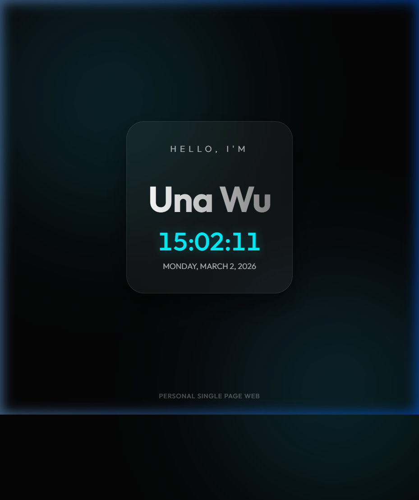

# Personal Single Page Web - Una Wu

This is a premium, modern single-page personal website built for **Una Wu**. It features a desk-mode aesthetic with glassmorphism, dynamic animations, and a real-time digital clock.

## 🚀 Live Demo
You can view the live demo here: [https://una0917.github.io/DeepRL_personalpage/](https://una0917.github.io/DeepRL_personalpage/)

## 📸 Preview

## ✨ Key Features
- **Premium Aesthetics**: Dark mode design with glassmorphism and subtle background blob animations.
- **Real-Time Clock**: A functional digital clock that updates every second.
- **Interactive Background**: Animated blobs that react to cursor movement for an immersive experience.
- **Modern Typography**: Uses the "Outfit" font from Google Fonts.
- **SEO Optimized**: Includes meta tags and semantic HTML structure.

## 🛠️ Built With
- **HTML5**: Semantic structure.
- **CSS3**: Custom variables, glassmorphism, and animations.
- **Vanilla JavaScript**: Dynamic clock logic and interactivity.

## 📅 Summary of Work - March 2, 2026
1. **Initial Design & Development**: Created `index.html`, `style.css`, and `script.js` with a focus on modern UI/UX.
2. **Repository Setup**: Initialized Git and connected to the GitHub repository.
3. **Deployment**: Configured tracking for the `main` branch to enable GitHub Pages deployment.
4. **Documentation**: Created this `README.md` and captured a preview screenshot.

---
*Created with ❤️ by Antigravity*
